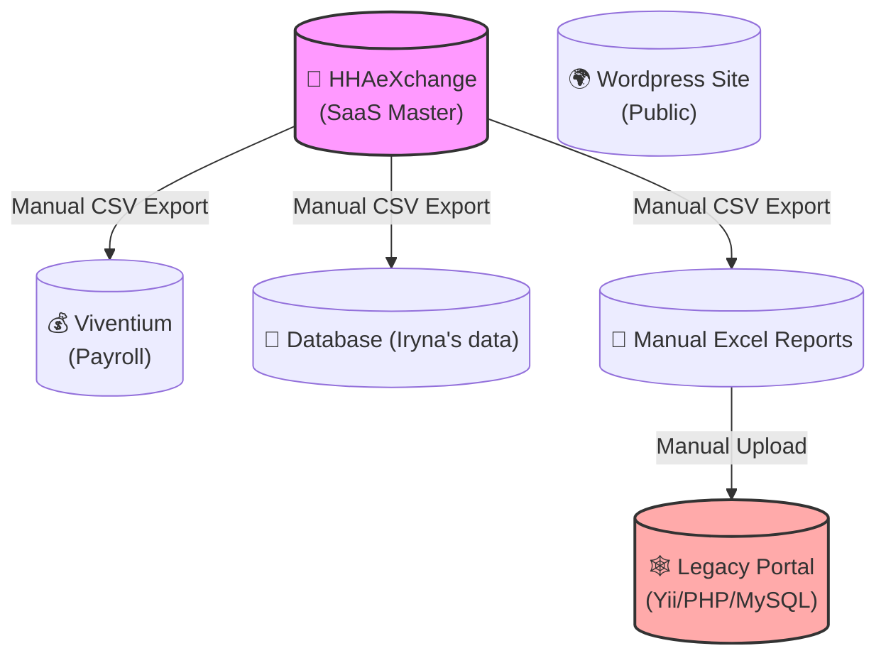
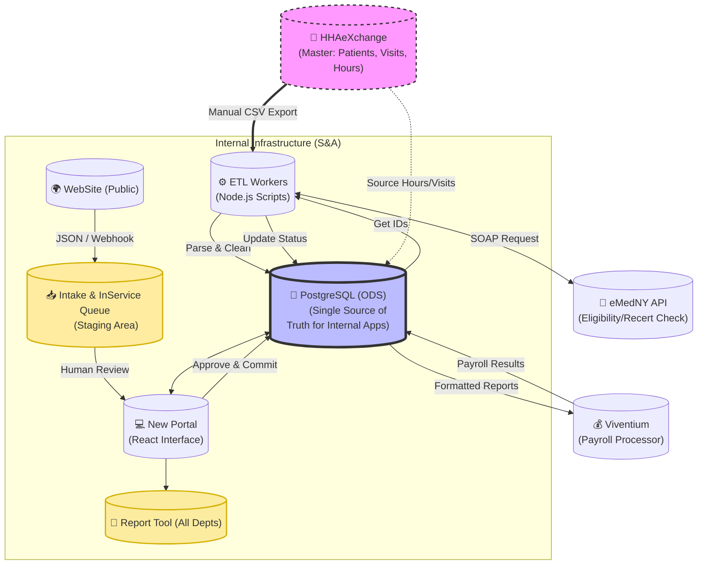

# 🗺️ Architecture Map: S&A Unified Data Landscape

**Goal:** Transition from fragmented data to a centralized ODS (Operational Data Store) based on PostgreSQL with automated data enrichment.

## 🏛️ Current State (As-Is)

Chaotic connections, manual data transfer, "junk portal."

## 🚀 Target State (To-Be)

PostgreSQL as a single hub, portal as a user-friendly interface.

