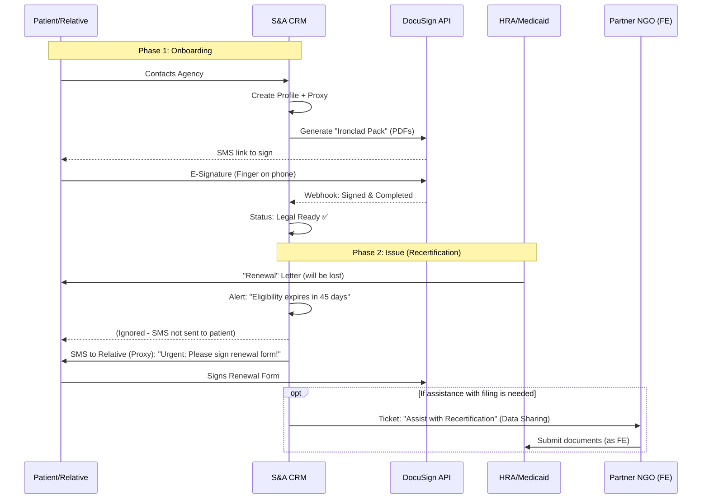

---
tags:
  - architecture
  - legal
  - medicaid
  - compliance
  - crm-feature
  - onboarding
created: 2026-02-10
status: Draft
project: SA-Unified-Internal-ERP
---
# Feature Spec: "Proxy-First" Module and Consent Management

## 1. The Pain Point

In the NY Medicaid/MLTC ecosystem, the agency (LHCSA) is legally "cut off" from managing the patient's lifecycle.

- **Blocked Actions:** Without the patient's (member's) participation, we cannot:
    - Request **Recertification** from HRA/DSS.
    - Change data (address, phone) in state systems (**ePACES**).
    - Initiate **Resumption of Care** after hospitalization.
    - Negotiate with the insurance company (**MCO**) for an **Authorization Increase**.
- **Risk:** Patients are often incapacitated, forgetful, or lack the language/technological skills to manage these tasks. Losing Medicaid due to a missed letter means a loss of **Revenue** for the agency.
- **Conflict of Interest:** The agency *cannot* be the official **Authorized Representative** for the patient for plan selection, as it is the beneficiary of the service (Conflict of Interest).

## 2. The Solution

**"Exoskeleton" Strategy (Proxy-First Approach):**

We do not legally replace the patient (which is illegal), but we create the digital and legal infrastructure that allows a **Proxy**—usually a relative—to act instantly and under our control.

**Key Components:**

1. **Ironclad Consent Pack:** Collecting all possible legal permissions *at the start* (Onboarding) to avoid chasing signatures in the future.
2. **Digital Proxy:** In the CRM, the primary contact for bureaucracy becomes the son/daughter rather than the patient themselves.
3. **Facilitated Enroller "Firewall":** Utilizing a partner NGO for tasks the agency is prohibited from doing (Medicaid application) through data integration.

## 3. Legal Architecture (The Ironclad Pack)

This package is generated and signed via DocuSign/Adobe Sign at the moment of registration.

| **Form / Document** | **Purpose** | **Validity Period** | **Critical Nuances** |
| --- | --- | --- | --- |
| **OCA-960 (HIPAA Release)** | Right to *receive* info from HRA, MCO, doctors. | **Indefinite** (if "Until revoked" is specified). | Recipient field: *S&A Unified Home Care*. |
| **MAP-3044 (NYC)** / **LDSS-4948** | Appointment of Representative at HRA (Medicaid Office). | Indefinite (until death/revocation). | > [!DANGER] **CRITICAL:** Do NOT enter the Agency. The **relative (Proxy)** is entered here. |
| **CMS-1696** (or MCO equivalent) | Representation before the Insurance (Appeals, Auth). | Usually 1 year / per case. | Allows filing Grievances on behalf of the patient. |
| **Assignment of Benefits (AOB)** | Right to receive payment directly from the MCO. | Indefinite. | Without this, the check goes to the patient. |
| **E-Consent & SMS Policy** | Consent for electronic signatures and auto-calls. | Indefinite. | Legalizes "signature via SMS click." |

## 4. Business Process (Workflow)



## 5. Technical Implementation (PERN Stack)

### 5.1 Data Model (PostgreSQL)

```SQL
-- Table for Proxies (separate from patients, as 1 person can be proxy for mom and dad)
CREATE TABLE proxies 
(id SERIAL PRIMARY KEY, 
full_name VARCHAR(255) NOT NULL, 
phone VARCHAR(20) NOT NULL, - For SMS/Auth email VARCHAR(255), 
relationship_to_patient VARCHAR(50), - 'son', 'daughter', 'neighbor' 
is_legal_guardian BOOLEAN DEFAULT false
);

-- Relationship Patient <-> Proxy
CREATE TABLE patient_proxies 
(patient_id INT REFERENCES patients(id), 
proxy_id INT REFERENCES proxies(id), 
is_primary_for_billing BOOLEAN DEFAULT false, 
is_primary_for_compliance BOOLEAN DEFAULT true, - Who to send HRA alerts to
PRIMARY KEY (patient_id, proxy_id)
);

-- Consent Registry
CREATE TABLE patient_consents 
(id SERIAL PRIMARY KEY, 
patient_id INT REFERENCES patients(id), 
form_type VARCHAR(50) NOT NULL, - 'OCA-960', 'MAP-3044', 'MCO_AUTH' 
signed_at TIMESTAMP WITH TIME ZONE, 
expires_at DATE, - NULL if indefinite document_url TEXT, - Link to S3/DocuSign status VARCHAR(20) CHECK (status IN ('active', 'expired', 'revoked')), 
signed_by_proxy_id INT REFERENCES proxies(id) - Who actually signed?
);
```

### 5.2 Backend Logic (Node.js/Express)

1. **Consent Manager Service:**
    - On patient creation: `Auto-trigger` sending the document pack.
    - Cron Job (`0 0 * * *`): Check `expires_at`. If < 30 days until expiration -> Create task for Coordinator + SMS to Proxy.
2. **DocuSign Integration:**
    - Use Templates. Populate fields (Patient Name, DOB, Address) via API so the Proxy only needs to provide the signature.

### 5.3 UI/UX (React)

- **"Legal Status" Widget** in the patient card:
    - Green Shield: "All forms active."
    - Red Shield: "Missing MAP-3044."
    - Action Button: "Resend Consent Pack via SMS."
- **Scripted Call:**
    - If an operator calls HRA, a tooltip pops up: *"Patient gave consent (OCA-960) on 2026-01-14. If the HRA operator asks for confirmation, fax it to number..."*

## 6. Risks and "Gray Areas"

> [!WARNING] Risk: Steering (Solicitation)
> Using the same CRM for both the Agency and the "Medicaid Application Partner" (FE) may raise questions during an **OMIG** (Office of the Medicaid Inspector General) audit.

**Mitigation:**

- **Role-Based Access Control (RBAC):** "Partners" only see a limited set of fields (Full Name, Medicaid Status, Documents). They CANNOT see the agency's financial data or data of other patients.
- **Data Partitioning:** Ideally—logical data separation or using an API to transfer the lead to the partner's external system rather than providing direct database access.

> [!INFO] Risk: Capacity
> If a patient suffers from dementia, their signature on the OCA-960 may be challenged. In this case, a **Power of Attorney (PoA)** or **Legal Guardianship** provided by the Proxy is required.
